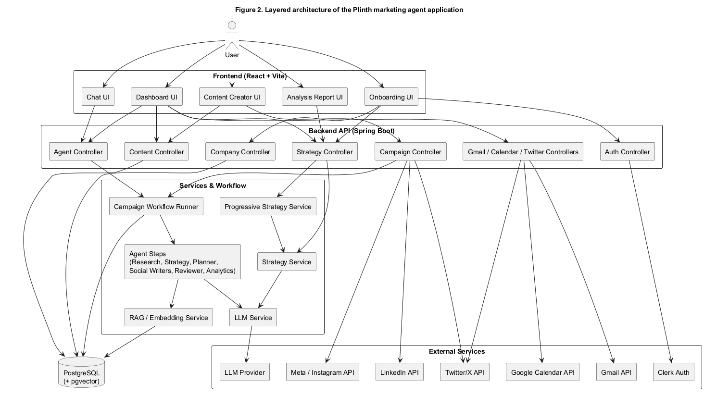
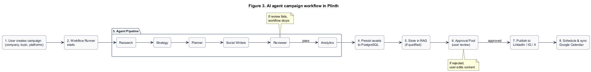
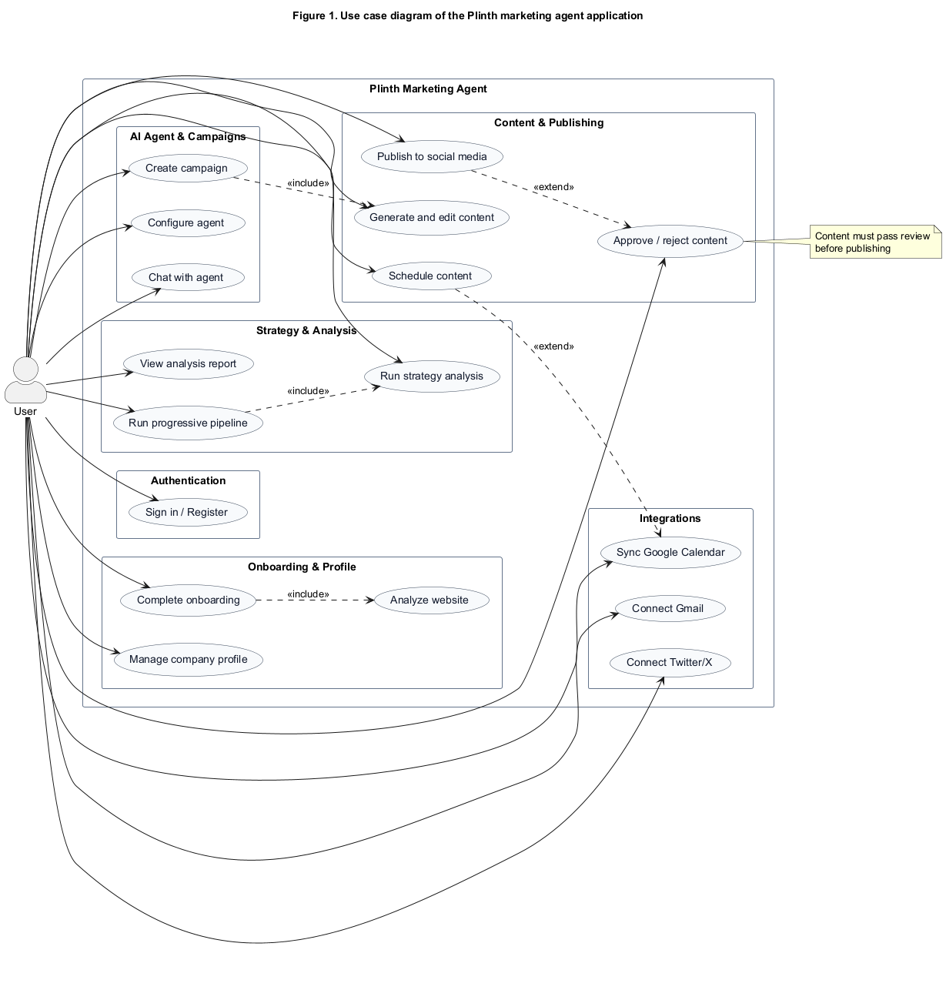

# Plinth

**Design and Implementation of an AI Agent-Based System for Digital Marketing Automation**

Graduation project (COMP498) — Yeditepe University, Department of Software Development  
**Author:** Said Cemal Türkdoğan  
**Supervisor:** Osman Haluk Bingöl

---

## Abstract

Plinth is a web-based AI marketing agent that automates core stages of digital marketing workflows, including market research, competitor analysis, strategy generation, content creation, human approval, and social publishing. The system models campaign execution as an ordered multi-step agent pipeline backed by persistent state, LLM reasoning, and retrieval-augmented memory (RAG). A React frontend provides onboarding, progressive analysis, dashboards, and content management; a Spring Boot backend orchestrates agent steps, external integrations, and PostgreSQL persistence with pgvector.

---

## System Overview

Plinth targets individual users and small teams who need AI-assisted marketing support without a full enterprise marketing suite. The application supports:

- Multi-step onboarding and company profile management
- Website, competitor, keyword, and content-gap analysis
- Progressive strategy pipeline (Research → Strategy → Plan → Assets)
- AI campaign workflow (Planner, Research, Strategy, Social Writers, Reviewer, Analytics)
- Content lifecycle management with approval pool
- Publishing and scheduling for LinkedIn, Instagram, and Twitter/X
- Gmail, Google Calendar, and Clerk/JWT authentication integrations
- RAG-based storage of high-quality campaign learnings

---

## Architecture

The system follows a layered architecture: React UI → REST API → services → agent workflow → PostgreSQL / external APIs.



*Figure 1. Layered architecture of the Plinth marketing agent application.*

| Layer | Responsibility |
|-------|----------------|
| Frontend (`apps/frontend`) | Onboarding, dashboard, analysis report, chat, content creator |
| Controllers | REST endpoints for auth, company, strategy, campaign, content, integrations |
| Services | Business logic, LLM orchestration, progressive pipeline, publishing |
| Agent workflow | Ordered `AgentStep` execution via `CampaignWorkflowRunner` |
| Persistence | JPA entities, Flyway migrations, pgvector RAG storage |
| Integrations | LinkedIn, Meta/Instagram, Twitter/X, Gmail, Google Calendar, Clerk |

---

## Agent Workflow

Campaign creation triggers a deterministic agent pipeline. Each step implements the `AgentStep` interface and persists output into campaign state.

| Order | Step | Responsibility |
|-------|------|----------------|
| 10 | Planner | Content plan and campaign structure |
| 20 | Research | Market and brand context gathering |
| 30 | Strategy | Marketing strategy generation |
| 40 | Social Writers | Platform-specific social posts |
| 50 | Reviewer | Quality, brand, and policy checks |
| 60 | Analytics | Performance scoring and learnings |



*Figure 2. AI agent campaign workflow in Plinth.*

---

## Use Case Model

A single actor—the **User**—interacts with authentication, onboarding, analysis, campaigns, content, approvals, integrations, and reporting features.



*Figure 3. Use case diagram of the Plinth marketing agent application.*

---

## Technology Stack

| Technology | Role |
|------------|------|
| Java 21 | Backend language |
| Spring Boot 3.3 | API, security, JPA, actuator |
| React 19 + Vite 5 | Frontend SPA |
| TypeScript | Frontend type safety |
| PostgreSQL | Primary database |
| pgvector | Vector embeddings for RAG |
| Flyway | Database migrations |
| Google Gemini | LLM for strategy and content |
| Clerk / JWT | Authentication |
| Docker Compose | Local deployment |

---

## Repository Structure

```
marketing-agent/
├── apps/
│   ├── backend/          # Spring Boot API, agent steps, publishers, RAG
│   └── frontend/         # React UI (onboarding, dashboard, pipeline, report)
├── docs/
│   ├── diagrams/         # Architecture, use case, and workflow diagrams
│   └── FULL_JAVA_MIGRATION_PLAN.md
├── docker-compose.yml
└── README.md
```

### Backend packages (`apps/backend`)

| Package | Purpose |
|---------|---------|
| `controller/` | REST API endpoints |
| `service/` | Business logic and orchestration |
| `agent/` | Agent workflow steps |
| `workflow/` | `CampaignWorkflowRunner`, `GoalDrivenOrchestrator` |
| `persistence/` | JPA entities and repositories |
| `llm/` | LLM client abstraction |
| `rag/` | Embedding and vector storage |
| `publisher/` | LinkedIn, Meta, Twitter publishing |
| `security/` | JWT and Clerk filters |

### Frontend routes (`apps/frontend`)

| Route | Screen |
|-------|--------|
| `/login` | Authentication |
| `/onboarding` | Company setup wizard |
| `/pipeline/:companyId` | Progressive strategy pipeline |
| `/report/:companyId` | Analysis report |
| `/dashboard/:companyId` | Main workspace |

---

## Documentation and Diagrams

Diagram sources and rendered images are stored under `docs/diagrams/`:

| File | Description |
|------|-------------|
| `Plinth_System_Architecture.png` | Layered system architecture |
| `Plinth_Use_Case_Diagram.png` | Use case diagram |
| `Plinth_Campaign_Workflow.png` | Agent campaign workflow |
| `system-architecture.puml` | PlantUML source — architecture |
| `use-case-diagram.puml` | PlantUML source — use cases |
| `campaign-workflow.puml` | PlantUML source — workflow |

To regenerate diagrams from PlantUML sources:

```bash
cd docs/diagrams
java -jar plantuml.jar -tpng *.puml
```

---

## Installation and Execution

### Prerequisites

- Java 21+
- Node.js 18+
- Docker and Docker Compose (recommended)
- Maven (for local backend builds)

### Run with Docker (recommended)

```bash
docker compose up --build
```

| Service | URL |
|---------|-----|
| Frontend | http://localhost:5173 |
| Backend API | http://localhost:8080 |
| PostgreSQL | localhost:5432 |

Stop containers:

```bash
docker compose down
```

Remove database volume:

```bash
docker compose down -v
```

### Run locally (without Docker)

**Backend**

```bash
cd apps/backend
mvn spring-boot:run
```

**Frontend**

```bash
cd apps/frontend
npm install
npm run dev
```

### Default configuration

| Setting | Default |
|---------|---------|
| API port | `8080` |
| Database URL | `jdbc:postgresql://localhost:5432/plinth` |
| Database user / password | `postgres` / `secret` |
| Meta Graph version | `v25.0` |

Configuration file: `apps/backend/src/main/resources/application.yml`  
Override via environment variables or Spring profiles.

---

## API Endpoints (selected)

| Method | Endpoint | Description |
|--------|----------|-------------|
| `GET` | `/api/health` | Health check |
| `POST` | `/api/campaigns` | Create campaign and run agent workflow |
| `GET` | `/api/campaigns/{campaignId}` | Retrieve campaign state and assets |
| `GET` | `/api/jobs/{jobId}` | Async job status |
| `POST` | `/api/campaigns/{campaignId}/publish/linkedin` | Publish to LinkedIn |
| `POST` | `/api/campaigns/{campaignId}/publish/meta/instagram` | Publish to Instagram |

Instagram publishing requires `INSTAGRAM_ACCESS_TOKEN` and `INSTAGRAM_IG_USER_ID`. Campaign `review.status` must be `pass`.

---

## Testing

Backend unit tests cover workflow orchestration and agent step behavior:

```
apps/backend/src/test/java/com/plinth/
├── workflow/CampaignWorkflowRunnerTest.java
└── agent/PlannerStepTest.java
```

Run tests:

```bash
cd apps/backend
mvn test
```

Manual functional testing was performed against the Docker stack using Chrome and Edge. See the project report (Section 5) for the full test summary.

---

## Scope and Limitations

**In scope:** web-based marketing agent, LLM strategy/content generation, progressive analysis, approval workflow, social publishing, Gmail/Calendar integrations.

**Out of scope:** native mobile apps, paid ad platform APIs (Google Ads / Meta Ads), real-time social analytics, multi-user team workspaces, payment/subscription systems.

---

## License and Academic Use

This repository was developed as a graduation project at Yeditepe University. Third-party frameworks and libraries are used under their respective licenses. See the project report (Section 6.1) for copyright and attribution details.

---

## References

- [Spring Boot Documentation](https://docs.spring.io/spring-boot/)
- [React Documentation](https://react.dev/)
- [PostgreSQL Documentation](https://www.postgresql.org/docs/)
- [pgvector](https://github.com/pgvector/pgvector)
- [Google Gemini API](https://ai.google.dev/gemini-api/docs)
- [Clerk Documentation](https://clerk.com/docs)
